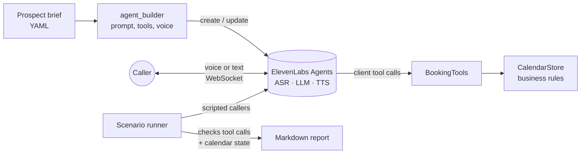

# Voice Demo Factory

**Brief in, tested French voice agent out.** A small pre-sales tool built on [ElevenLabs Agents](https://elevenlabs.io/docs): describe a prospect's business in a 30-line YAML file, get a tailored phone agent that books appointments in French, and a test report proving it behaves before the prospect ever hears it.

I built it the way I work in pre-sales: when I do the same thing for every customer, I turn it into a tool. A booking voice agent is the same pattern for a garage, a hair salon or a clinic. What changes is the services, the opening hours, the tone and one or two business-specific details. So those live in a brief, and everything else is generated.

```text
$ python -m booking_agent deploy briefs/garage-du-canal.yaml
Agent prêt : agent_8801m3pn...
$ python -m booking_agent test briefs/garage-du-canal.yaml
▶ Réservation complète d'une vidange ... OK
▶ Créneau déjà pris, l'agent propose une alternative ... OK
▶ Demande un dimanche ... OK
▶ Pas de réservation sans confirmation ... OK
▶ Demande hors périmètre (devis) ... OK

5/5 réussis. Rapport : reports/garage-du-canal-20260929-1540.md
```

## A real call, from the test report

Run against the live ElevenLabs agent on 29 September 2026 (full reports: [garage](examples/report-garage-du-canal.md), [salon](examples/report-atelier-mona.md), 8/8 scenarios passing). The caller asks for a time that is not in the short list the agent offered:

```text
🧑 Bonjour, je voudrais faire une vidange demain matin.
  ⚙ check_availability({'service': 'vidange', 'date': '2026-10-06'})
    -> suggested_slots: 08:30, 10:30, 14:15, 16:15 · total_available: 32
🤖 Alors, pour une vidange demain matin, mardi six octobre, j'ai un créneau à huit heures trente
   et un autre à dix heures trente. Lequel vous arrange le mieux ?
🧑 Neuf heures, c'est possible ?
  ⚙ check_availability({'service': 'vidange', 'date': '2026-10-06', 'time': '09:00'})
    -> requested_time_available: true
🤖 Oui, c'est tout à fait possible ! Neuf heures, c'est libre pour une vidange demain. On le prend ?
🧑 Jeanne Martin, 06 12 34 56 78, et ma plaque c'est AB-123-CD.
🤖 Parfait ! Donc, c'est un rendez-vous pour une vidange demain, mardi six octobre, à neuf heures,
   au nom de Jeanne Martin, [...] et la plaque AB-123-CD. C'est bien ça ?
🧑 Oui, c'est parfait.
  ⚙ book_appointment({'service': 'vidange', 'date': '2026-10-06', 'time': '09:00', ...})
    -> confirmation_code: 8UQGL
🤖 Votre rendez-vous est confirmé ! Le code de confirmation est Huit, U, Q, G, L.
```

**What the live run caught.** The first run of this scenario failed: the agent told the caller 9:00 was not possible and booked 10:30 instead. 9:00 was free, but the tool only returned four sample slots and the model treated them as the full list. Unit tests could not see this, because the tool itself was correct. The fix: `check_availability` takes an optional `time`, answers whether that exact slot is free, and otherwise offers the closest slot before and after. The salon run caught a second one: the agent booked without checking availability first, so the prompt now forbids it.

## How it works



| Piece | What it does |
|---|---|
| `brief.py` | Loads and validates the prospect brief (services, durations, prices, opening hours, FAQ, tone, extra field such as a licence plate). |
| `agent_builder.py` | Turns a brief into the agent: system prompt written for voice, first message, three client tools with JSON schemas, `end_call`, TTS and turn settings. Pure function: `preview` shows the result offline. |
| `deploy.py` | Idempotent: re-running after editing a brief updates the same agent and tools instead of creating duplicates. |
| `calendar_store.py` | The business rules, with no ElevenLabs dependency: slots that fit the service duration within opening hours, no overlaps, no past slots, booking horizon, short confirmation codes without ambiguous characters (no 0/O, 1/I). |
| `tools.py` | Client tools the agent calls: `check_availability`, `book_appointment`, `cancel_appointment`. Business errors come back as data the agent can explain; unexpected errors never crash the live call. |
| `session.py` | Live session by voice (microphone) or text, with date injected through dynamic variables and every tool call recorded. |
| `scenarios.py` | Plays scripted callers against the real agent in text mode and checks outcomes, not wording. |

## Design choices

- **Client tools instead of webhooks.** Tools run in the Python process, so a demo works on a laptop with no public URL or tunnel. Moving to server tools (webhooks) for telephony is a config change on the same handlers.
- **Test outcomes, not sentences.** An LLM never says the same thing twice, so scenarios assert on what matters: which tools were called and what ended up in the calendar. "Slot already taken", "closed on Sunday", "no booking without an explicit yes" and "out-of-scope quote request" are all covered.
- **Written for the ear.** The prompt enforces short turns, no lists, times said out loud, phone numbers read back in pairs, and confirmation codes spelled letter by letter. Tool results are short on purpose: at most four suggested slots, never the full day, plus an exact check when the caller asks for a specific time.
- **Deterministic tests.** Scenarios freeze "today" and seed the calendar, so a failure means the agent changed, not the date.
- **Network drops are not agent failures.** If the websocket drops mid-call (keepalive timeout), the scenario is replayed once and the report says so. A genuine agent failure is never retried, so flakiness stays visible.
- **Low latency defaults.** `eleven_flash_v2_5` for TTS and a fast LLM (configurable with `AGENT_LLM`).

## Quick start

```bash
python3.12 -m venv .venv && source .venv/bin/activate   # Python 3.10+
pip install -e ".[dev]"            # add ",voice" for microphone mode (needs PortAudio: brew install portaudio)
cp .env.example .env               # then paste your ElevenLabs API key

python -m booking_agent preview briefs/garage-du-canal.yaml   # offline: see the generated prompt and tools
python -m booking_agent deploy  briefs/garage-du-canal.yaml   # create the agent in your workspace
python -m booking_agent talk    briefs/garage-du-canal.yaml   # talk to it (add --text to type)
python -m booking_agent test    briefs/garage-du-canal.yaml   # run the caller scenarios, write reports/*.md
pytest                                                         # offline unit tests
```

New prospect: copy a file in `briefs/`, edit it, run `deploy`. Two examples are included, a garage in Paris and a hair salon in Lyon, to show the same engine serving two very different businesses.

## Limits and next steps

- Scenario callers are scripted lines. If the agent asks things in an unexpected order, a scenario can fail for the wrong reason. Next step: ElevenLabs' native agent testing with simulated users, keeping the same outcome checks.
- The calendar is a JSON file. A real deployment would plug `CalendarStore` into the customer's system (Google Calendar, Doctolib, a DMS for garages) behind the same three tools.
- No telephony yet. Adding a phone number (Twilio or SIP trunk) and moving tools to webhooks is the path to a real line.
- One language per brief. Language detection and an English fallback would be a small addition.

## Stack

Python 3.10+, ElevenLabs Python SDK (Agents: WebSocket conversations, client tools, dynamic variables), PyYAML, pytest, ruff.
